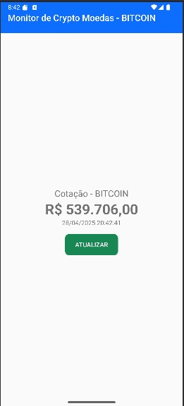

# Android Crypto Monitor 📈

Aplicativo Android simples para monitorar o preço do Bitcoin (BTC) em tempo real.

Desenvolvido com **Kotlin**, **Jetpack Compose** e **Retrofit**.

---

# ✨ Funcionalidades

- Exibe a cotação atual do Bitcoin.
- Atualização manual da cotação ao clicar no botão "Atualizar".
- Interface moderna baseada em Material 3.

---

# 🛠 Tecnologias Utilizadas

- Kotlin
- Jetpack Compose
- Material Design 3
- Retrofit2
- Gson
- AndroidX Core e Lifecycle

---

# 📂 Estrutura do Projeto

## 📁 `/components`

Componentes visuais reutilizáveis do app:

- **ButtonRefresh.kt**  
  Componente do botão "Atualizar" que dispara uma ação ao ser clicado.
- **QuoteInformation.kt**  
  Exibe informações da cotação do Bitcoin (preço, etc.).
- **ToolbarMain.kt**  
  Barra de título (toolbar) no topo da aplicação.

---

## 📁 `/service`

Camada de comunicação com a API:

- **ApiService.kt**  
  Define a interface Retrofit para buscar dados da cotação.
- **RetrofitClient.kt**  
  Cria a configuração da conexão Retrofit usada para acessar a API.

---

## 📁 Arquivos principais

- **MainActivity.kt**  
  Tela principal do aplicativo. Controla a estrutura da tela e a lógica de interação.

- **build.gradle.kts**  
  Configurações do Gradle para o módulo do app.

- **settings.gradle.kts**  
  Arquivo de configuração principal do projeto.

---

# 📜 Explicação das Funções

## MainActivity.kt

### `onCreate()`
- Responsável por desenhar a interface com o método `setContent`.
- Organiza a estrutura visual usando `Column`, `Surface`, e inclui:
    - `QuoteInformation()` para exibir a cotação.
    - `ButtonRefresh()` para permitir o usuário atualizar os dados.

---

## ButtonRefresh.kt

### `ButtonRefresh(onClick: () -> Unit)`
- Componente `@Composable`.
- Desenha um botão estilizado.
- Recebe uma função `onClick` que será executada quando o botão for pressionado.

---

## QuoteInformation.kt

### `QuoteInformation()`
- Componente `@Composable`.
- Exibe as informações da cotação do Bitcoin.
- (Pode ser expandido no futuro para exibir mais dados como variação, gráfico, etc.)

---

## ToolbarMain.kt

### `ToolbarMain(title: String)`
- Componente `@Composable`.
- Desenha a barra superior com o título do aplicativo.
- Aceita um `String` para personalizar o título.

---

## ApiService.kt

### `ApiService`
- Interface Retrofit.
- Define a função `@GET` para buscar a cotação atual do Bitcoin através de uma API pública.

---

## RetrofitClient.kt

### `RetrofitClient`
- Singleton que configura e fornece a instância do Retrofit.
- Define a base URL e adiciona o conversor Gson para transformar JSON em objetos Kotlin.

---


## rodando 


# 🚀 Como Rodar o Projeto


1. Clone este repositório:

```bash
git clone https://github.com/felipemeschiatti/crypto.git